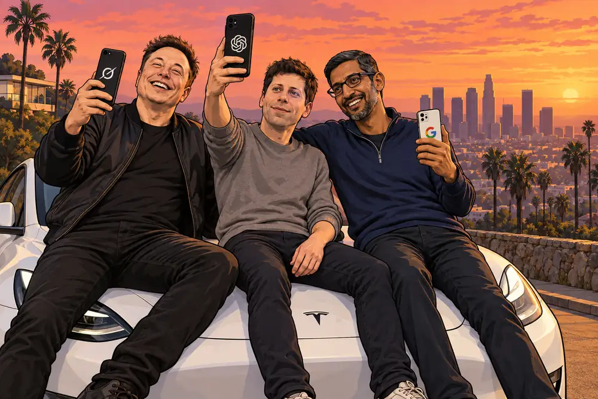
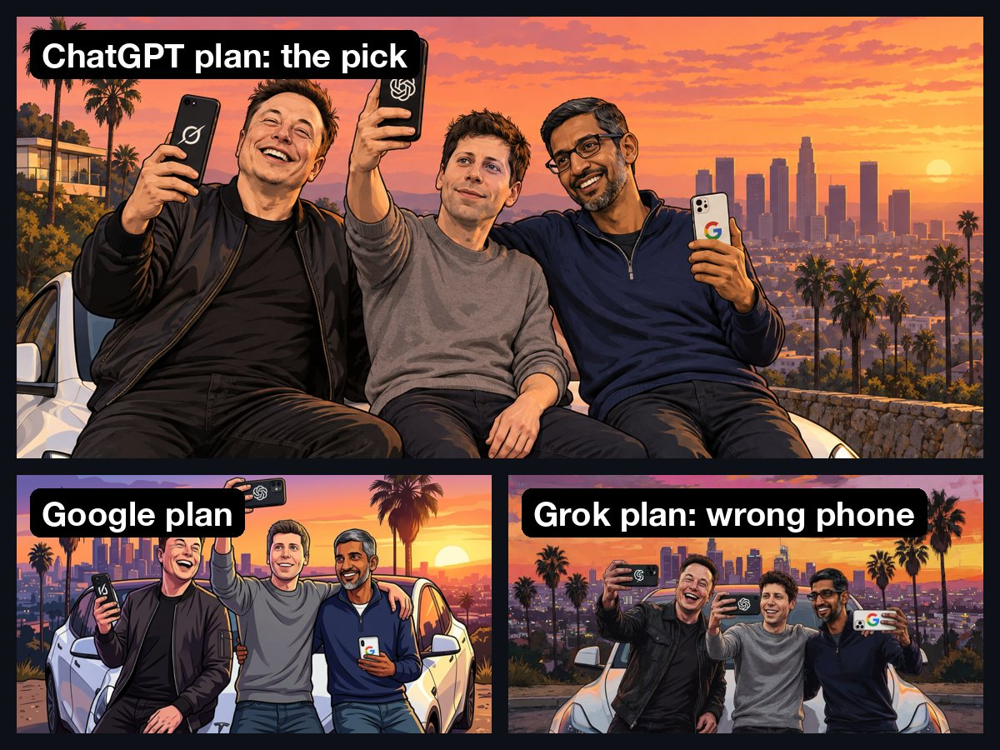
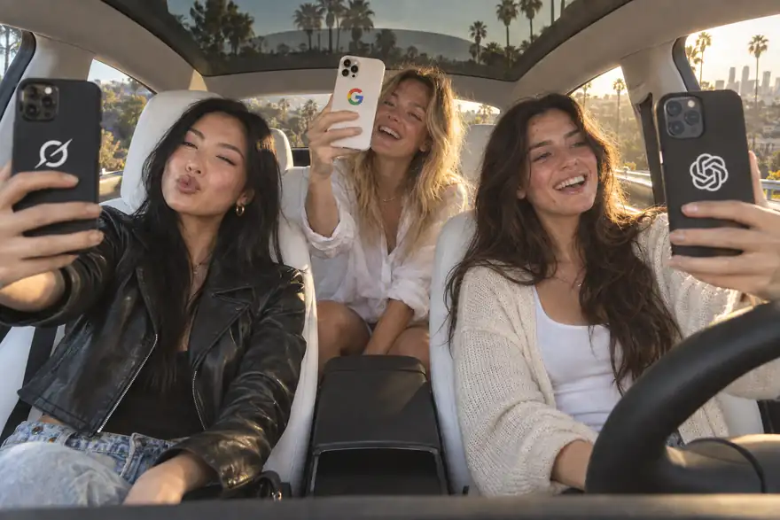
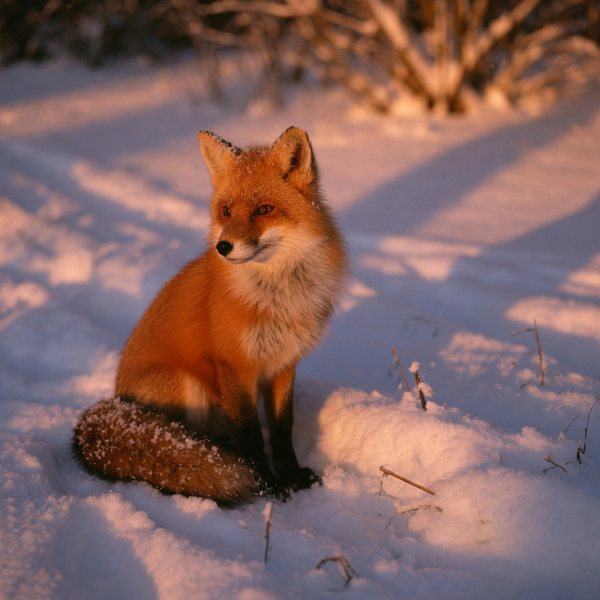
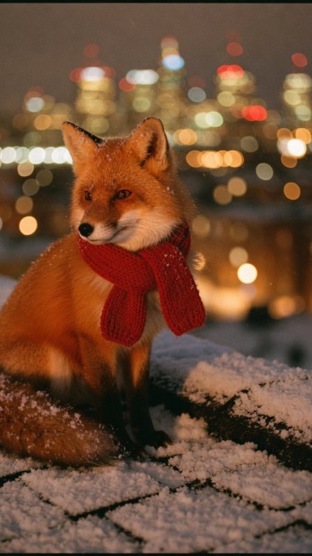
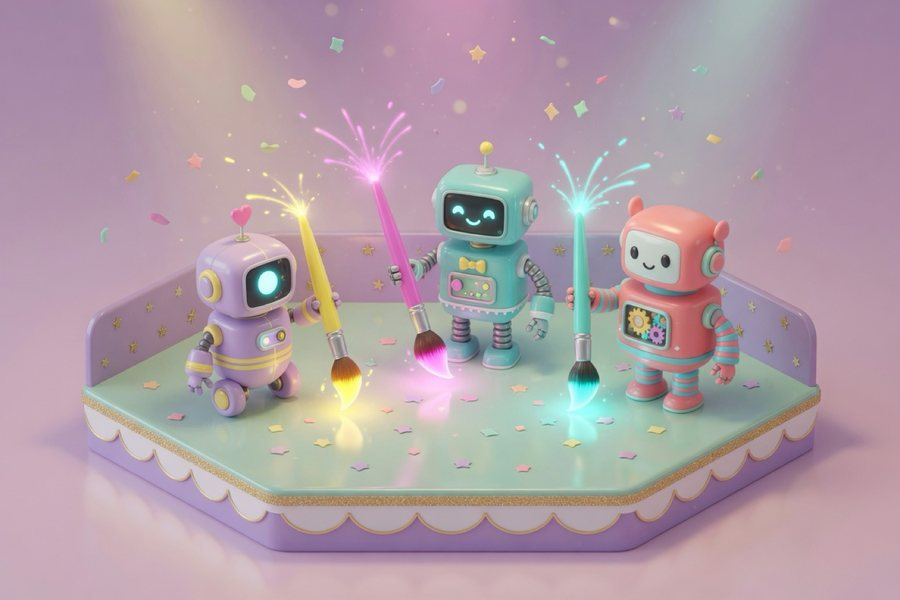

<p align="center"><picture>
  <source media="(prefers-reduced-motion: reduce)" srcset="assets/hero-still.jpg">
  
</picture></p>
<p align="center"><sub>Elon (Grok), Sam (ChatGPT) and Sundar (Gemini), just the boys hanging out. Every frame above was painted by <code>subpowers</code> on ChatGPT and Google AI plans, in three styles, the same characters kept consistent with <code>--ref</code>. Parody illustration: not affiliated with or endorsed by Elon Musk, Sam Altman, Sundar Pichai, xAI, OpenAI or Google.</sub></p>

<h1 align="center">subpowers</h1>

<p align="center"><b>The AI subscriptions you already pay for, as powers for every agent.</b><br>
Your agents can now make images on the ChatGPT, Google or Grok plan you already pay for.<br>
No API key. No per-image bill. A signed receipt with every image.</p>

<p align="center">Works with Claude Code, Codex, Cursor, Gemini CLI, and anything that can run a command.</p>

---

## Install in one message

Paste this into Claude Code (or any coding agent):

```text
Install https://github.com/itsluisc/subpowers for me, then tell me what I need to log in to.
```

That's it. Your agent reads the "For AI agents" section below and does the rest. The only thing you do yourself is log in to your own account (a browser window opens once).

Prefer typing it yourself? Three commands:

```bash
git clone https://github.com/itsluisc/subpowers ~/.claude/skills/subpowers
bash ~/.claude/skills/subpowers/install.sh
codex login        # ChatGPT painter: choose "Sign in with ChatGPT"
```

Using Google or Grok instead (or too)? Install their CLI and sign in once:

```bash
curl -fsSL https://antigravity.google/cli/install.sh | bash   # Google (Antigravity)
agy                # sign in, then quit

curl -fsSL https://x.ai/cli/install.sh | bash                # xAI (Grok, needs SuperGrok)
grok login
```

Then ask any agent for an image. Or type it:

```bash
subpowers image "isometric 3D render of a tiny coffee shop on a floating island, no text" ~/Desktop/shop.png
```

## Council mode: every subscription paints it, you pick the best

<p align="center"></p>

```bash
subpowers image "the three founders on a Tesla hood at a Los Angeles overlook, GTA loading-screen style" out.png --painter council
```

One prompt, three painters in parallel, one side-by-side sheet. Above: ChatGPT won this round, Antigravity was close, and Grok handed Elon a ChatGPT phone. You pay nothing extra for the second and third opinions: they come out of plans you already have.

## Same cast, every scene

<p align="center"></p>

Paint a cast once, then pass that image back with `--ref` and write "the same people as in the reference". These six scenes are one cast (all AI-generated people), painted on a ChatGPT plan.

## What it made (real outputs, real commands)

Every image below was made by subpowers on a normal subscription, and every caption comes from the receipt saved next to it.

<table>
<tr>
<td width="33%"><br><sub><b>ChatGPT</b> · prompt only · <code>--size 1024x1024</code> · 76 s</sub></td>
<td width="33%"><br><sub><b>ChatGPT</b> · <code>--ref</code> the image on the left, "same scene at night" · 85 s</sub></td>
<td width="33%"><br><sub><b>ChatGPT</b> · product macro · <code>--size 1024x1024</code> · 61 s</sub></td>
</tr>
<tr>
<td><br><sub><b>Your product shot</b> (the reference)</sub></td>
<td><br><sub><b>ChatGPT</b> · <code>--ref</code> the bottle, "on a mossy rock by a mountain stream". Same cap, same finish.</sub></td>
<td><br><sub><b>ChatGPT</b> · poster · <code>--size 1024x1536</code> exact</sub></td>
</tr>
<tr>
<td><br><sub><b>Antigravity</b> (Nano Banana 2) · 1:1 · 21 s</sub></td>
<td><br><sub><b>Antigravity</b> · <code>--size 1080x1350</code> (4:5 for Instagram) · 20 s</sub></td>
<td><br><sub><b>Antigravity</b> · 16:9 · 19 s</sub></td>
</tr>
<tr>
<td><br><sub><b>Grok</b> · a fox (the reference)</sub></td>
<td><br><sub><b>Grok</b> · <code>--ref</code> the fox, "red scarf, rooftop at night" · 35 s</sub></td>
<td><br><sub><b>Grok</b> · 3:2 · 40 s</sub></td>
</tr>
</table>

## Every image comes with a receipt

AI images are about to get questioned everywhere. subpowers saves a plain-text receipt next to each one: your prompt, the prompt the model actually received, which model painted it, the tool's own signature (C2PA, signed by OpenAI or Google), sizes and timings. A real one, from the car frame in the hero above (folder paths trimmed):

```text
PROMPT (as given):
Recreate the reference photo as the same moment: the same parked Tesla Model Y with the white interior, ...
Change only how real the blonde and the brunette look. ...

provenance:
  door: subpowers/bin/chatgpt-image
  codex: codex-cli 0.157.0
  driver model: gpt-6-sol (chain: gpt-6-sol:gpt-5.6-sol; reasoning high)
  image model: OpenAI's current ChatGPT image model, chosen server-side | C2PA says: ChatGPT/gpt-image (signed by OpenAI)
  references: 1 (car-chatgpt.png)
  requested size: 1536x1024
  painter size: 1536x1024
  delivered size: 1536x1024
  image_gen saved_path: ~/.codex/generated_images/01a0db4a-.../exec-77922a9d-....png
```

The receipt even tells you when an image was upscaled locally, so nothing gets passed off as something it isn't.

## It tells you exactly what's wrong

<p align="center"></p>

`subpowers doctor` checks every painter, your logins, and where your agents can find the skill, then prints the exact command for anything that's off. `subpowers doctor --smoke` makes one real test image per painter.

## Always the best model, without you touching anything

| Piece | How it stays current |
|---|---|
| The painters | OpenAI and Google pick the image model on their side on every call, so it can't go stale. Grok is asked for xAI's quality Imagine model (`grok-imagine-image-quality`); a plan without it falls back to xAI's default by itself. |
| The helper models | The text model that hands your prompt to the painter runs at **high** effort on every plan, because it writes what the painter actually sees. ChatGPT: read fresh from codex's own model list on *your* account, newest first, retiring models skipped. Antigravity: the newest Gemini Flash at its High setting. Grok: the newest non-fast Grok model. |
| The codex CLI | Checked once a day and updated automatically (turn off with `SUBPOWERS_NO_AUTOUPDATE=1`). |

**Your own picks** go in `~/.subpowers/config`, one `KEY=value` per line; anything you set in the shell still wins. For example, to keep the image helper off your most expensive model so its quota stays free for real work:

```bash
CHATGPT_IMAGE_DRIVERS=gpt-6-sol     # ChatGPT helper model chain, first one tried first
CHATGPT_IMAGE_EFFORT=high           # low | medium | high | xhigh
AGY_IMAGE_EFFORT=high               # low | medium | high
GROK_IMAGE_MODEL=                   # empty = xAI's default Imagine model instead of the quality one
```

## The three painters

| | ChatGPT | Antigravity | Grok |
|---|---|---|---|
| You need | a ChatGPT plan with Codex access + `codex login` | a Google plan with Antigravity + `agy` signed in | SuperGrok + the Grok CLI + `grok login` |
| Model | OpenAI's current image model | Nano Banana 2 (Gemini 3.1 Flash Image) | Grok Imagine |
| Speed | 60 to 100 s | 17 to 33 s | 32 to 40 s |
| Shapes | square, 3:2, 2:3 exact; others requested | 1:1, 2:3, 3:2, 3:4, 4:3, 9:16, 16:9 | 1:1, 16:9, 9:16, 3:2, 2:3 |
| Reference photos | yes, any number | yes, up to 3 | yes (image edit) |

`subpowers image` uses ChatGPT when it's connected, then Antigravity, then Grok. Pick one with `--painter antigravity|grok` or set `SUBPOWERS_PAINTER`. Every painter runs with API-key auth switched off, so it can only ever use your plan.

**Video is next.** Grok Imagine video (image to video, 6 or 10 s) already works through the Grok CLI on SuperGrok once its video output is set up, and Google's Gemini Omni (video from up to 5 reference photos) is on the [roadmap](ROADMAP.md). ChatGPT has no video door (OpenAI shut Sora down in 2026).

## Beyond one image

```bash
subpowers image "..." out.png --painter council      # every connected subscription at once + a side-by-side sheet
subpowers refs add me selfie.heic event.jpg          # save who you are once (or a product, or a world)
subpowers image "me on a rooftop at golden hour" out.png --refs me
subpowers sheet me sheet.png --painter council       # character sheet: front, profiles, 3/4, back, face close-up
subpowers storyboard shots.txt board/ --refs me --style "35mm, deep blue palette"
```

- **Three versions or one?** `--painter council` (same as `all`) gives you one take per subscription in a single sheet, so you pick the winner.
- **Reference sets** keep the same person (or product) consistent across every image, sheet and storyboard frame.
- **Storyboards:** write one shot per line (framing, action, setting). Frames paint in parallel and land in `storyboard.jpg` in order, with the same person in every shot.
- **Cancel a plan, nothing breaks.** A paused subscription just shows OFF in `subpowers powers`, and `auto` moves to the next painter when one fails or runs out of quota.
- **One rule for real people:** never pass a photo of someone *else* as a setting reference. The painters borrow faces from every reference. Describe the set in words instead.
- **Same cast, new scene:** pass an earlier image with `--ref` and say "the same people as in the reference". That is how the hero and the cast above stay consistent from scene to scene.

```bash
subpowers library find podcast                        # every image you have made, newest first, with its tags
subpowers library find --painter grok --tag project=launch
subpowers slideshow slider.webp a.png b.png c.png     # one looping slider of your picks (plays in any README)
```

- **Every image is indexed.** subpowers adds a line to `~/.subpowers/library.jsonl` for each image: where it is, the painter, the image model, the helper model and effort, the prompt, references, sizes and the C2PA signer, plus your own tags (`SUBPOWERS_TAGS=project=launch,cast=trio`). Nothing is copied. Want backups? Drop an executable script at `~/.subpowers/hooks/after-image` (it gets the image, its receipt and its id) and send them to B2, S3 or Drive.

## Use it everywhere

- **Claude Code**: automatic. It loads `~/.claude/skills/subpowers` at startup (restart open sessions).
- **Codex**: automatic, via `~/.codex/skills` and `~/.agents/skills` (the installer links both).
- **Cursor, Gemini CLI, custom agents, your `AGENTS.md` / `CLAUDE.md`**: paste this block into the agent's rules:

```markdown
## Making images
To make any image, run:
  subpowers image "<detailed prompt>" /absolute/path/out.png [--size 1536x1024] [--ref photo.jpg] [--painter antigravity|grok]
- Uses my own ChatGPT / Google AI / SuperGrok subscription. No API key.
- Takes 20 s to 2 min: use a 10-minute command timeout.
- It prints the saved path. Look at the image before saying it is done.
- Full instructions: ~/.claude/skills/subpowers/SKILL.md
```

Update anytime with `subpowers update`. If a copy installed before v0.3.1 stops with "commit your changes", run `git -C ~/.claude/skills/subpowers -c core.fileMode=false pull --ff-only` once (the old installer's `chmod` looked like an edit). Uninstall: delete `~/.claude/skills/subpowers` plus the links in `~/.agents/skills`, `~/.codex/skills` and `~/.local/bin`.

## For AI agents: how to install this for your user

1. `git clone https://github.com/itsluisc/subpowers ~/.claude/skills/subpowers` (if it already exists, `git -C ~/.claude/skills/subpowers pull` instead).
2. `bash ~/.claude/skills/subpowers/install.sh`. It links the skill for other agents, puts `subpowers` on PATH, installs the codex CLI if npm or Homebrew is present, and runs the doctor.
3. Read the doctor's last lines. If no painter is ready, tell your user to run **one** of these themselves (each opens a browser to sign in, which you must not do for them): `codex login` (ChatGPT), `agy` (Antigravity; install it first with `curl -fsSL https://antigravity.google/cli/install.sh | bash`) or `grok login` (Grok, SuperGrok; install with `curl -fsSL https://x.ai/cli/install.sh | bash`).
4. After they log in, run `subpowers doctor --smoke` and show them the test image.
5. From then on, read `~/.claude/skills/subpowers/SKILL.md` before making images.

Never ask the user for an API key, and never put one in. subpowers only uses the logins they own.

## Good to know

- Images use your plan's normal usage limits; an image costs more of your allowance than a text message. If you run out, that painter says so and stops, and `auto` moves on to your next connected plan. Nothing waits for the reset, and it never switches to a paid API.
- This rides on the official `codex` and `agy` command-line tools, not on a published image API, so providers can change behavior. The doctor and the daily codex update are there for exactly that.
- `agy` has no per-tool allowlist, so the Antigravity painter cannot limit its helper to the image tool. Each call skips agy's permission prompts, so it runs with `--sandbox`, an empty temporary profile (no MCP servers) and a temporary folder.
- Use your own login on your own machine. Don't share credentials or use this to resell access.
- The hero is a parody illustration of public figures: they did not pose for it and do not endorse subpowers. The phone-case logos show which plan each one stands for. Please don't use subpowers to make photorealistic images of real people in made-up scenes. Nothing in the code prevents it, and each provider's own rules still apply.
- subpowers is an independent open-source project. ChatGPT and Codex are trademarks of OpenAI; Antigravity, Gemini and Nano Banana are trademarks of Google; Grok and Grok Imagine are trademarks of xAI. None of them made or endorses this.

## What's next: build it with us

This is the first power. The [roadmap](ROADMAP.md) starts with a **Studio**: save reference sets of *you*, your products and your world once, and every agent can put them in any scene on command. After that, more powers from the subscriptions you already have.

Want to build a piece of it? Read [CONTRIBUTING.md](CONTRIBUTING.md), open an issue, send a pull request. Every good idea that ships gets credited.

## Credits

The ChatGPT painter started as [oakplank/gpt-image-bridge](https://github.com/oakplank/gpt-image-bridge) (MIT) and was rebuilt from there: newest-model resolver, receipts, reference photos, doctor, installer, and a second painter. Built by [Luis Carrillo](https://github.com/itsluisc) with his agent team. MIT licensed.
