<p align="center">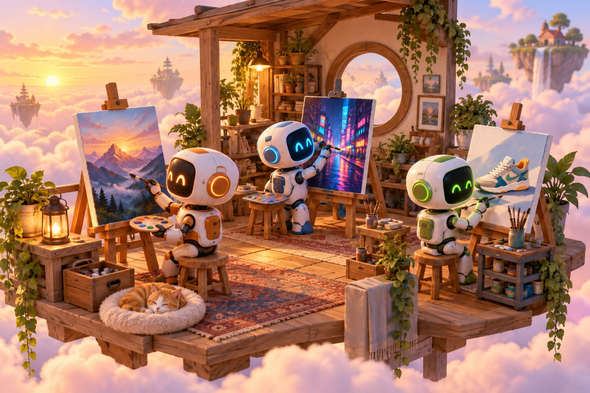</p>

<h1 align="center">subpowers</h1>

<p align="center"><b>The AI subscriptions you already pay for, as powers for every agent.</b><br>
Power #1: your agents make images with your ChatGPT or Google AI plan.<br>
No API key. No per-image bill. A receipt with every image.</p>

<p align="center">For vibe coders · content creators · business owners · innovators<br>
Works with Claude Code, Codex, Cursor, Gemini CLI, and anything that can run a command.</p>

---

## Install in one message

Paste this into Claude Code (or any coding agent):

```text
Install https://github.com/itsluisc/subpowers for me, then tell me what I need to log in to.
```

That's it. Your agent reads the "For AI agents" section below and does the rest. The only thing you do yourself is log in to your own account (a browser window opens once).

Prefer typing it yourself? Three commands:

```bash
git clone https://github.com/itsluisc/subpowers ~/.claude/skills/subpowers
bash ~/.claude/skills/subpowers/install.sh
codex login        # ChatGPT painter: choose "Sign in with ChatGPT"
```

Using Google instead (or too)? Install the Antigravity CLI and sign in once:

```bash
curl -fsSL https://antigravity.google/cli/install.sh | bash
agy                # sign in, then quit
```

Then ask any agent for an image. Or type it:

```bash
subpowers image "isometric 3D render of a tiny coffee shop on a floating island, no text" ~/Desktop/shop.png
```

## What it made (real outputs, real commands)

Every image below was made by subpowers on a normal subscription, and every caption comes from the receipt saved next to it.

<table>
<tr>
<td width="33%">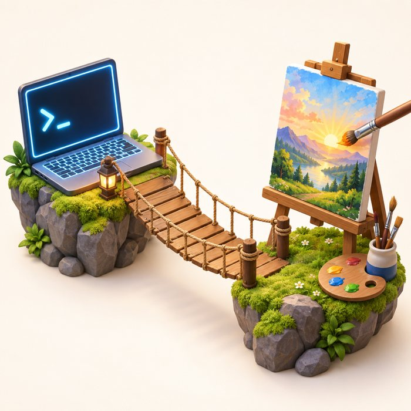<br><sub><b>ChatGPT</b> · prompt only · <code>--size 1024x1024</code> · 76 s</sub></td>
<td width="33%">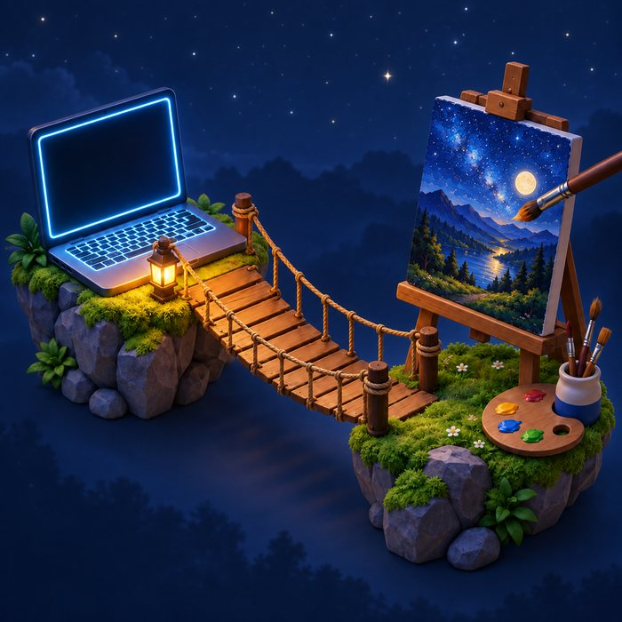<br><sub><b>ChatGPT</b> · <code>--ref</code> the image on the left, "same scene at night" · 85 s</sub></td>
<td width="33%">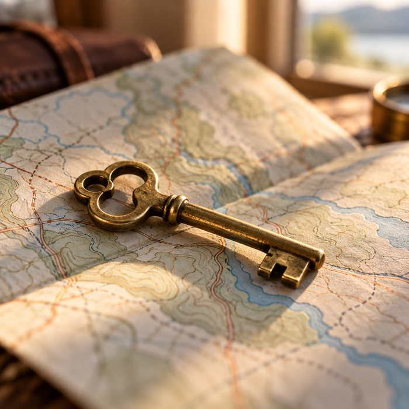<br><sub><b>ChatGPT</b> · product macro · <code>--size 1024x1024</code> · 61 s</sub></td>
</tr>
<tr>
<td>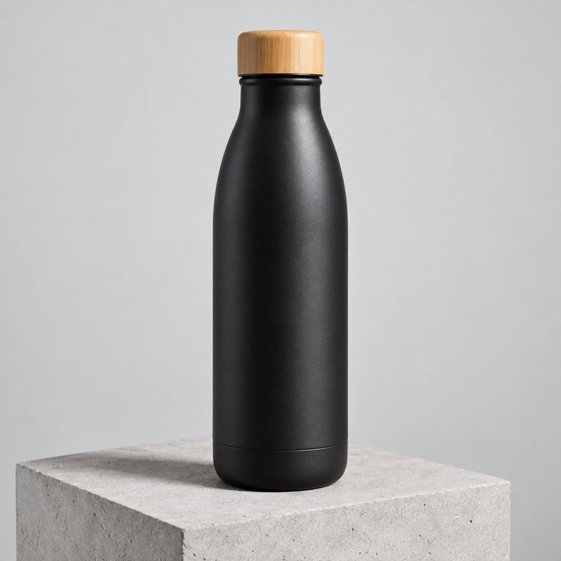<br><sub><b>Your product shot</b> (the reference)</sub></td>
<td>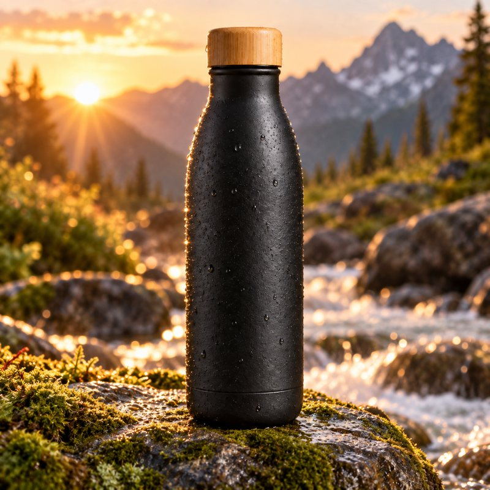<br><sub><b>ChatGPT</b> · <code>--ref</code> the bottle, "on a mossy rock by a mountain stream". Same cap, same finish.</sub></td>
<td>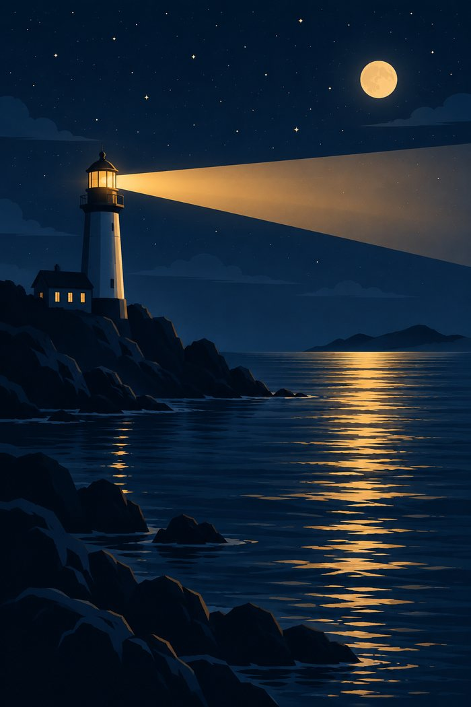<br><sub><b>ChatGPT</b> · poster · <code>--size 1024x1536</code> exact</sub></td>
</tr>
<tr>
<td>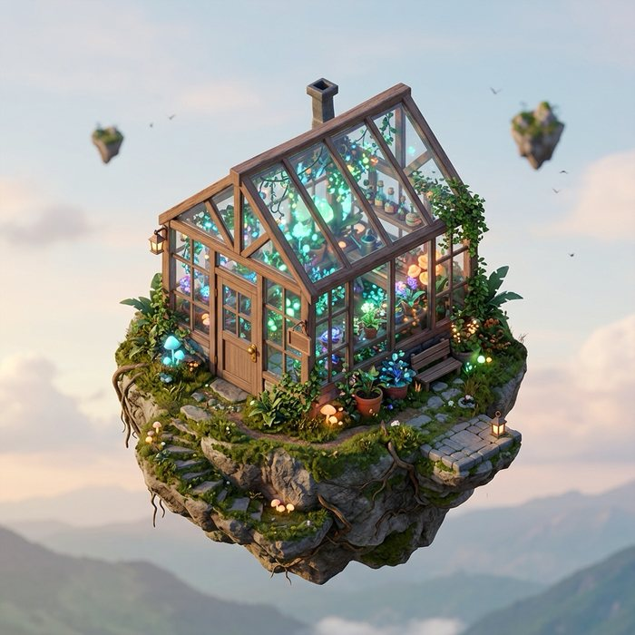<br><sub><b>Antigravity</b> (Nano Banana 2) · 1:1 · 21 s</sub></td>
<td>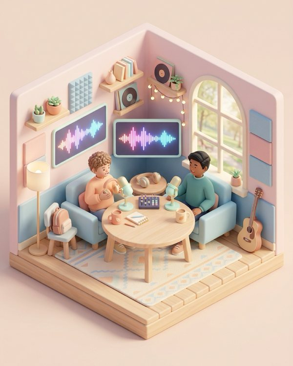<br><sub><b>Antigravity</b> · <code>--size 1080x1350</code> (4:5 for Instagram) · 20 s</sub></td>
<td>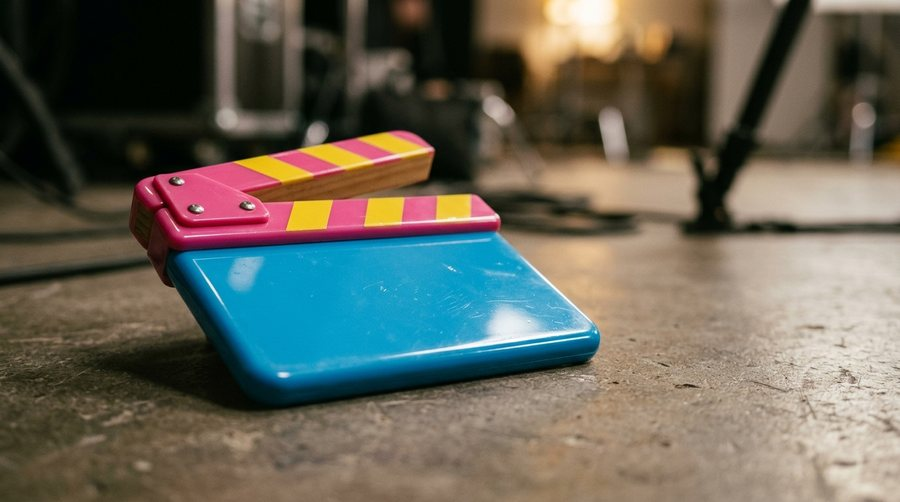<br><sub><b>Antigravity</b> · 16:9 · 19 s</sub></td>
</tr>
</table>

## Every image comes with a receipt

AI images are about to get questioned everywhere. subpowers saves a plain-text receipt next to each one: your prompt, the prompt the model actually received, which model painted it, the tool's own signature (C2PA, signed by OpenAI or Google), sizes and timings. A real one, unedited except for the folder paths:

```text
PROMPT (as given):
isometric 3D render of two small friendly robots high-fiving in front of a glowing laptop, confetti, ...

provenance:
  door: antigravity-image (~/.claude/skills/subpowers/bin)
  agy: 1.2.11
  auth: Antigravity OAuth subscription, isolated profile, zero MCP servers, no API key
  driver model: gemini-3.8-flash-low (chain: gemini-3.8-flash-low:gemini-3.7-flash-low:default; effort low)
  image model: gemini-3.1-flash-image (Gemini 3.1 Flash Image = Nano Banana 2), chosen server-side by Antigravity
  C2PA: Google C2PA Core Generator Library; actions: Created by Google Generative AI + Applied imperceptible SynthID watermark (signed by Google LLC)
  generate_image calls: 1; tool time: 11.704083s; door wall: 23s
  requested size: 1536x1024
  painter size: 1264x848 (jpg)
  delivered size: 1536x1024 (center-cropped ... LOCAL UPSCALE: the painter's native size is 1264x848; signed original kept)
```

The receipt even tells you when an image was upscaled locally, so nothing gets passed off as something it isn't.

## It tells you exactly what's wrong

<p align="center">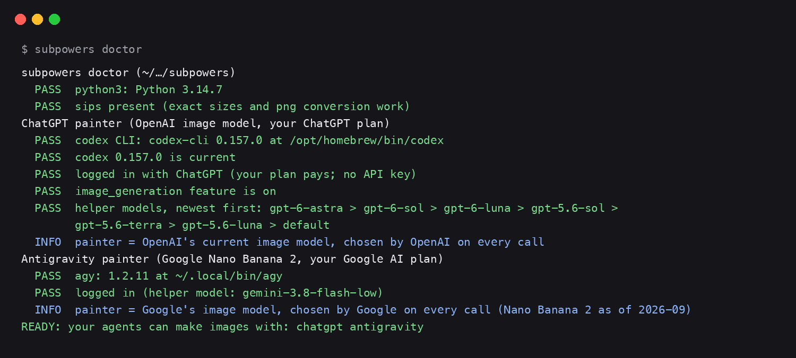</p>

`subpowers doctor` checks both painters, your logins, and where your agents can find the skill, then prints the exact command for anything that's off. `subpowers doctor --smoke` makes one real test image per painter.

## Always the newest model, without you touching anything

| Piece | How it stays current |
|---|---|
| The painters | OpenAI and Google pick the image model on their side on every call. Nothing on your machine names it, so it can't go stale. |
| The ChatGPT helper model | Read fresh from codex's own list of models on *your* account, newest first, every call. Retiring models are skipped. |
| The codex CLI | Checked once a day and updated automatically (turn off with `SUBPOWERS_NO_AUTOUPDATE=1`). |
| The Antigravity helper model | The newest Gemini Flash that `agy models` lists. |

## The two painters

| | ChatGPT | Antigravity |
|---|---|---|
| You need | a ChatGPT plan with Codex access + `codex login` | a Google plan with Antigravity + `agy` signed in |
| Model | OpenAI's current image model | Nano Banana 2 (Gemini 3.1 Flash Image) |
| Speed | 60 to 100 s | 17 to 25 s |
| Shapes | square, 3:2, 2:3 exact; others requested | 1:1, 2:3, 3:2, 3:4, 4:3, 9:16, 16:9 |
| Reference photos | yes, any number | yes, up to 3 |

`subpowers image` uses ChatGPT when it's connected, otherwise Antigravity. Pick one with `--painter antigravity` or set `SUBPOWERS_PAINTER`.

## Use it everywhere

- **Claude Code**: automatic. It loads `~/.claude/skills/subpowers` at startup (restart open sessions).
- **Codex**: automatic, via `~/.codex/skills` and `~/.agents/skills` (the installer links both).
- **Cursor, Gemini CLI, custom agents, your `AGENTS.md` / `CLAUDE.md`**: paste this block into the agent's rules:

```markdown
## Making images
To make any image, run:
  subpowers image "<detailed prompt>" /absolute/path/out.png [--size 1536x1024] [--ref photo.jpg] [--painter antigravity]
- Uses my own ChatGPT / Google AI subscription. No API key.
- Takes 20 s to 2 min: use a 10-minute command timeout.
- It prints the saved path. Look at the image before saying it is done.
- Full instructions: ~/.claude/skills/subpowers/SKILL.md
```

Update anytime with `subpowers update`. Uninstall: delete `~/.claude/skills/subpowers` plus the links in `~/.agents/skills`, `~/.codex/skills` and `~/.local/bin`.

## For AI agents: how to install this for your user

1. `git clone https://github.com/itsluisc/subpowers ~/.claude/skills/subpowers` (if it already exists, `git -C ~/.claude/skills/subpowers pull` instead).
2. `bash ~/.claude/skills/subpowers/install.sh`. It links the skill for other agents, puts `subpowers` on PATH, installs the codex CLI if npm or Homebrew is present, and runs the doctor.
3. Read the doctor's last lines. If no painter is ready, tell your user to run **one** of these themselves (each opens a browser to sign in, which you must not do for them): `codex login` (ChatGPT) or `agy` (Antigravity; install it first with `curl -fsSL https://antigravity.google/cli/install.sh | bash`).
4. After they log in, run `subpowers doctor --smoke` and show them the test image.
5. From then on, read `~/.claude/skills/subpowers/SKILL.md` before making images.

Never ask the user for an API key, and never put one in. subpowers only uses the logins they own.

## Good to know

- Images use your plan's normal usage limits; an image costs more of your allowance than a text message. If you run out, it says so and waits for the reset. It never switches to a paid API.
- This rides on the official `codex` and `agy` command-line tools, not on a published image API, so providers can change behavior. The doctor and the daily codex update are there for exactly that.
- Use your own login on your own machine. Don't share credentials or use this to resell access.
- subpowers is an independent open-source project. ChatGPT and Codex are trademarks of OpenAI; Antigravity, Gemini and Nano Banana are trademarks of Google. Neither company made or endorses this.

## What's next: build it with us

This is the first power. The [roadmap](ROADMAP.md) starts with a **Studio**: save reference sets of *you*, your products and your world once, and every agent can put them in any scene on command. After that, more powers from the subscriptions you already have.

Want to build a piece of it? Read [CONTRIBUTING.md](CONTRIBUTING.md), open an issue, send a pull request. Every good idea that ships gets credited.

## Credits

The ChatGPT painter started as [oakplank/gpt-image-bridge](https://github.com/oakplank/gpt-image-bridge) (MIT) and was rebuilt from there: newest-model resolver, receipts, reference photos, doctor, installer, and a second painter. Built by [Luis Carrillo](https://github.com/itsluisc) with his agent team. MIT licensed.
