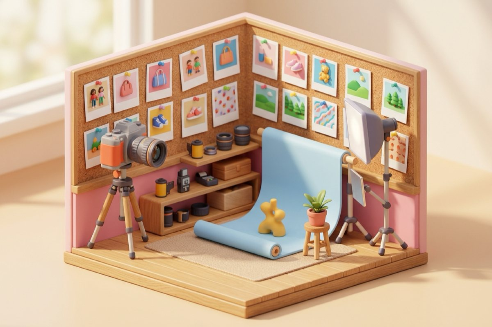

# Roadmap

subpowers turns subscriptions people already pay for into powers any agent can use. Images are power #1. Here's where it goes next. Anything below is open for contributors: comment on the issue, or open one if it isn't there yet.

## Shipped

- [x] ChatGPT painter (OpenAI's current image model through `codex`)
- [x] Antigravity painter (Nano Banana 2 through `agy`)
- [x] Grok painter (Grok Imagine through the `grok` CLI, SuperGrok)
- [x] Reference photos (`--ref`), including iPhone HEIC
- [x] Receipt beside every image (prompt, model, C2PA signer, timings)
- [x] Always-newest helper model + daily codex update
- [x] `subpowers doctor` with live checks, one-command installer for Claude Code, Codex and other agents
- [x] Fan-out: `--painter all` paints with every connected subscription at once and builds a side-by-side sheet
- [x] Graceful fallback: a paused plan or spent quota moves to the next painter; nothing breaks
- [x] Reference sets: `subpowers refs add NAME photos...`, then `--refs NAME` anywhere
- [x] Character sheets: `subpowers sheet NAME out.png` (front, profiles, 3/4, back, face close-up)
- [x] Storyboards: `subpowers storyboard shots.txt outdir --refs NAME`
- [x] Best-quality defaults: every helper model at high effort, Grok on xAI's quality Imagine model (automatic fallback), reference photos padded to the asked shape
- [x] Your own defaults in `~/.subpowers/config` (helper model, effort, image model)
- [x] Council mode (`--painter council`), the image library, and `subpowers slideshow`
- [x] A test suite that runs every painter end to end against stand-in CLIs (no quota spent), in CI on Ubuntu and macOS

## Next: the video power (`subpowers video`)

Probed 2026-09-26, honestly:

- [ ] **Grok Imagine video** (image to video and reference to video, 6 or 10 s, up to 720p, with first/last frame, keyframes and built-in voices) is exposed by the Grok CLI on SuperGrok. Accounts in privacy (zero data retention) mode must give it an S3-compatible output bucket first (`~/.grok/managed_config.toml`, [xAI docs](https://docs.x.ai/build/settings/zdr-video-storage)); after that it is the same painter shape as `grok-image`.
- [ ] **Google Gemini Omni** (video from text plus up to 5 photo references, 10 s) is included in Google AI Plus, Pro and Ultra, but only inside the Gemini app, Flow and Vids. Not reachable from the `agy` CLI yet, so it needs a browser driver.
- [ ] ChatGPT: no video door (OpenAI shut Sora down in 2026).
- [ ] A daily probe that turns on a native CLI lane the day `generate_video` appears in `codex` or `agy`.

## Next: the Studio

- [ ] **World sheets**: a small text file per world (palette, style anchors, recurring characters) that is added to every prompt that uses it
- [ ] **Studio page**: a local web page to browse every image with its receipt, compare painters side by side, and re-run a winner with one click
- [ ] **Shot planning**: `subpowers storyboard --plan "<concept>"` asks a subscription text model to write the shot list first

## Later: more powers

- [ ] **Browser lanes** for subscriptions with no CLI (web-only image and video models), run in a lightweight headless browser so it doesn't eat your RAM
- [ ] **Second opinion / copy**: ask the ChatGPT, Gemini or Grok model inside your plan for a draft or a critique, with the same receipt habit
- [ ] **Windows and Linux**: image steps no longer need macOS (Pillow or `sips`), and CI runs the suite on Ubuntu with stand-in CLIs. Still to do: real Linux reports with the actual CLIs, and Windows
- [ ] **More painters**: any subscription that ships an official CLI with a built-in image or video tool

## Won't do

- API keys or paid per-call fallbacks. The whole point is the plan you already have.
- Anything that shares one person's login with another person.
